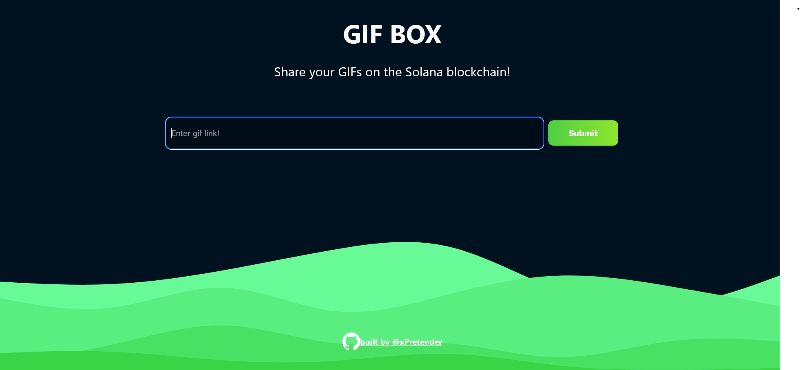
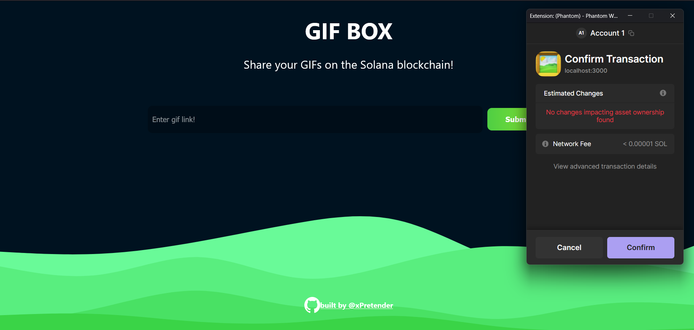

# Solana Anchor Web3 App

This project is a Solana Anchor app with a React frontend. It was created by following the tutorial provided by [Buildspace](https://buildspace.so/p/build-solana-web3-app).

## Getting Started

To run this project locally, follow these steps:

1. Clone the repository:

   ```bash
   git clone https://github.com/xPretender/SolanaDapp.git
   ```

2. Install dependencies:

   ```bash
   npm install
   ```

3. Start the development server:

   ```bash
   npm run dev
   ```

4. Open your web browser and navigate to [http://localhost:3000](http://localhost:3000) to view the app.

## Screenshots





## Wallet Integration

This app requires a wallet for Solana transactions. We recommend using the [Phantom](https://phantom.app/) wallet.

## Tutorial Source

The development of this app was guided by the tutorial available at [Buildspace](https://buildspace.so/p/build-solana-web3-app).

## License

This project is licensed under the [MIT License](LICENSE).

## Acknowledgments

This project is based on Buildspace's tutorial on Solana DApps.
[Buildspace](https://buildspace.so/p/build-solana-web3-app)

Tutorials and Concepts from SolDev
[SolDev](https://www.soldev.app/).

And Finally, Thank you to the mentors from The BLOKC for guiding us.
